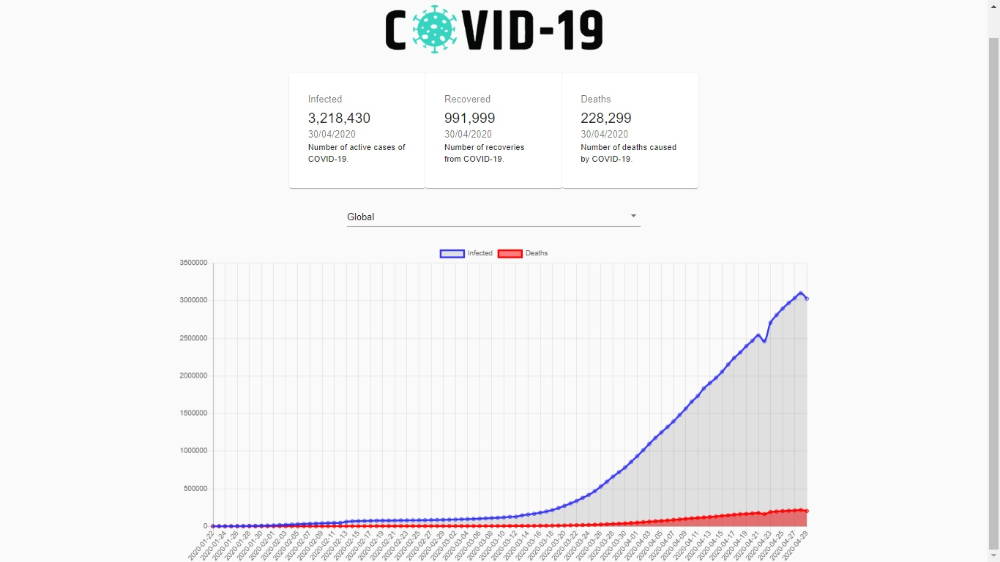

# Covid-19 Tracker - Estudo de Caso




Este repositório foi desenvolvido com base no video abaixo

[YouTube](https://www.youtube.com/watch?v=khJlrj3Y6Ls&list=WL&index=12&t=0s)

O mesmo tem como objetivo o estudo das tecnólogias abaixo:

## Tecnólogias

ReactJs 
MaterialUI
Charts
API

## API

URL: https://covid19.mathdro.id/api

## Instalação

Você precisará ter apenas o [NodeJS](https://nodejs.org) instalado na sua máquina, e após isso, clonar este repositório:
```sh
  $ git clone https://github.com/Bruno-Goudric/covid-tracker.git
```

Depois disso acesse a pasta da aula que você deseja e instale as dependências executando o seguinte comando:
```sh
  $ yarn install  ou npm install
```

## Executando a aplicação

Execute o comando a baixo para inicializar o Expo:
```sh
  $ yarn start  ou npm start
```

